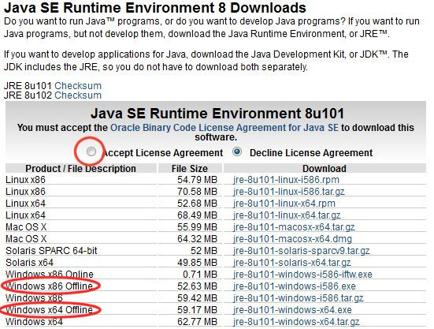
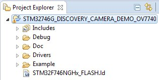
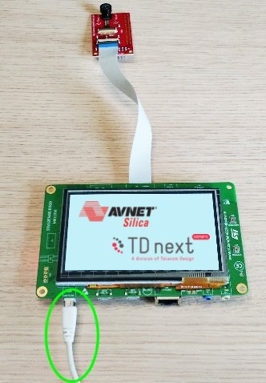

.. index:: development

.. _develop:

Developing Guide
================

This guide will provide instructions to install the development environment needed to compile and debug the demo firmware for the **STM32F746G-DISCO** board. 
This guide is written using Windows.

The main steps will be:

- Install stsw-link009 USB driver
- Install System Workbench for STM32
- Download & Install the project
- Import & build
- Debug

Install stsw-link009 USB driver
-------------------------------

1. Download accepting the agreement of the **stsw-link009 USB driver** from the `ST website <http://www.st.com/content/st_com/en/products/embedded-software/development-tool-software/stsw-link009.html>`_

.. image:: _static/get_link009.jpg

.. note::

  In order to get the software it is necessary have an account on my.st.com website. You can create it `here <http://www.st.com/content/st_com/en/user-registration.html?referrer=https://my.st.com/content/my_st_com/en/products/embedded-software/development-tool-software/stsw-link009.license%3d1473754475284.html>`_
  
2. Extract and install the driver launching **dpinst_amd64.exe** if you have Windows 64-bit or **dpinst_x86.exe** if your Windows is 32-bit. If you don't know it just go in **Control Panel -> System** to check the version or if you have Windows 10 go to **Settings -> System -> About**.

3. During the installation accept all the persmission requests.

Install System Workbench for STM32
----------------------------------

1. The ST System Workbench requires Java Runtime Environment. If you don't yet have it installed on your system please follow the next steps otherwise go to the step 5

2. Download the JavaSE JRE. Minimal version: **JavaSE 1.7.0_45**. You can find it `here <http://www.oracle.com/technetwork/java/javase/downloads/index.html>`_.
We suggest to use the **offline** version.

3. Accept the license agreement and download the installation file, **Windows x86** for 32-bit system or **Windows x64** for 64-bit system. If you don't know it just go in **Control Panel -> System** to check the version or if you have Windows 10 go to **Settings -> System -> About**.

4. Launch the installation file and follow all the default options.

5. Download the ST System Workbench from its website `openstm32 <http://www.openstm32.org/Downloading+the+System+Workbench+for+STM32+installer>`_.
There are two versions, 32-bit or 64-bit. It depends what kind of version your windows is. If you don't know, just go in **Control Panel -> System** to check the version.

.. note::

  In order to get the software it is necessary have an account on the openstm32 website. You can do it from `here <http://www.openstm32.org/tiki-register.php>`.

6. Launch the installer, accept the terms and install it. We have used this path:

7. During the installation it will install the ST drivers, if necessary **accept** all the permissions.

Download & Install the project
------------------------------

1. Download the project `evSTM32f7v01.zip <_static/CameraDemo_DriverTD7740_STM32f7.zip>`_

2. Download STM32CubeF7_1 from the `ST website <http://www.st.com/content/st_com/en/products/embedded-software/mcus-embedded-software/stm32-embedded-software/stm32cube-embedded-software/stm32cubef7.html>`_ accepting the agreement.

.. note::

  In order to get the software it is necessary have an account on my.st.com website. You can create it `here <http://www.st.com/content/st_com/en/user-registration.html?referrer=https://my.st.com/content/my_st_com/en/products/embedded-software/development-tool-software/stsw-link009.license%3d1473754475284.html>`_

3. Extract STM32CubeF7 package, in our example we have installed it in **C:\\Ac6\\STM32Cube_FW_F7_V1.4.0**

4. Copy the provided folder **CameraDemo_DriverTD7740_STM32f7** to **C:\\Ac6\\STM32Cube_FW_F7_V1.4.0\\Projects\\STM32746G-Discovery\\Examples\\**.

Import & build
--------------

1. Launch the System Workbench for STM32

2. Select **File -> import** and choose **General -> Existing Projects into Workspace**

3. In Select root directory, click on Browse and select the path: **C:\\Ac6\\STM32Cube_FW_F7_V1.4.0\\Projects\\STM32746G-Discovery\\Examples\\CameraDemo_DriverTD7740_ST**

4. The project should be automatically detected and selected. Click on **Finish** button.

5. Select the project **STM32746G_DISCOVERY_CAMERA_DEMO_OV7740**

6. Press **F5** key to refresh the project tree

7. Build the project selecting **Project -> Build All**

8. The building will finish generating the **STM32746G_DISCOVERY.bin** and **STM32746G_DISCOVERY.elf** files

Debug
-----

1. Connect the adapter board to the Camera Connector of the **STM32F746G-DISCO** board via FFC cable:

.. image:: _static/connections.jpg

2. Plug in the **USB Mini** cable from the PC to the **CN14** connector of the board

3. From the menu go to **Run -> Debug Configurations**

4. Double click on **Ac6 STM32 Debugging**

5. Click on **Browse...** button and select the project **STM32746G_DISCOVERY_CAMERA_DEMO_OV7740**

6. Click on **Browse...** button and find the elf file, using our path it will be **C:\\Ac6\\STM32Cube_FW_F7_V1.4.0\\Projects\\STM32746G-Discovery\\Examples\\CameraDemo_DriverTD7740_STM32f7\\SW4STM32\\STM32746G_DISCOVERY\\Debug\\STM32746G_DISCOVERY.elf**

7. Check the **Debugger** tab if all the options are right

8. Apply the changes clicking on **Apply** button

.. image:: _static/debug_3.jpg

9. Then click on the **Debug** button

10. Accept the **debug perspective** and the debug will start on the **main** entry point

