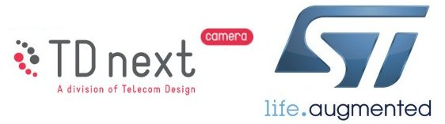
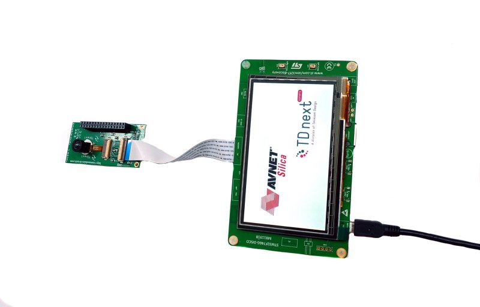
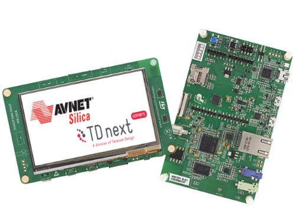
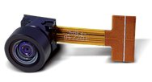

.. K82F-TD7740 documentation master file

Welcome to Embedded Vision ST documentation
===========================================

:Version: 1.00B
:Copyright: (C)2016 Avnet Silica company
:Date: 26 Sep 2016
:Reference name: EV-STM32F7CAM-DVK

Embedded Vision ST
------------------

*Embedded Vision STM32F7 Camera TD7740 Development Kit*

.. note::

  The color of the adapter board in the kit can be different than the color on the images in the Quick Start Guide and Developing Guide. However this does not affect the functionality of the board

.. index:: index

**INTRODUCTION**
----------------

This Development Kit is a cost effective and flexible tool for video applications with the STM32
Cortex M7 MCU. **TD next** miniature camera modules interface with the **STM32F7** for high quality
VGA or lower resolution video. The solution is a full development tool with examples to simplify
development and to create your own application.

The Embedded Vision STM32F7 Camera Development Kit includes:

- STMicroelectronics STM32F746 Discovery kit
- TD next TD7740 adapter board
- TD next TD7740-FBAC VGA camera module
- USB mini cable
- Flexible flat cable
- Quick Reference Card

The **TD7740** Image sensor is based on Omnisvision 1/5" OV7740 CMOS VGA sensor.

- Solderless module: Camera Socket (SMK compatible) or Flex connector (FPC: Flat Pack Connector) 8 x 8 mm module mate on standard Camera Module Socket
- Active Image size VGA (640x480) 30 fps, and smaller
- Digital RGB 8/10 bits or YUV 8 bits output
- Lens Focal length 1.3 mm Field of view from H=66° to 128°
- Pixel size 4.2µm x 4.2µm
- Type of filter; dual filter for daylight and night vision, single filter for daylight vision, no filter for higher image quality
- Power supply Analog: 3 to 3.6 V I/O: 1.7 to 3.47 V Core: 1.5V +-5% (internal regulator)
- Typical power requirements Active: 48 mA Standby: 20 µA Core: 1.5V +-5% (internal regulator)
- Operating range -30°/70°C stable image 0°/50°C

Development tools
*****************

ST releases the **Kinetis Design Studio IDE** including support for the STM32F746 Discovery kit. Based on free, open-source software including Eclipse, GNU Compiler Collection (GCC), GNU Debugger (GDB), and others, the Kinetis Design Studio IDE offers designers a simple development tool with no code-size limitations.

Contents:

.. toctree::
   :maxdepth: 2

   qs
   develop

