.. index:: qs

.. _quick:

Quick Start Guide
=================

This guide will show you how to run the demo. This demo allows you to immediately try the **TD7740** camera.
This guide is written using **Windows** Operating System.

Hardware necessary
------------------

- **TDNx016** Board
- **TD7740** camera
- **STM32F746G-DISCO** board
- 1 mini-USB cable
- PC with Windows

Launching the Demo
------------------

The **EV-STM32F7CAM-DVK** is already programmed with the demo. All you need to do is the assembly and supply it power.
1. Plug the **TD7740** camera to the **TDx016** adapter board:

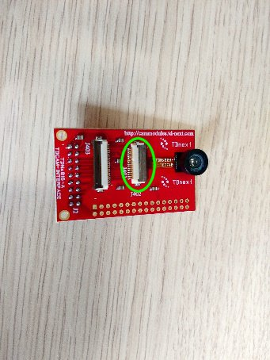

2. Connect the adapter board to the Camera Connector of the **STM32F746G-DISCO** board via FFC cable:

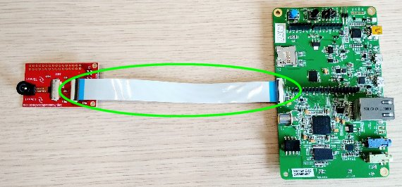

3. Plug in the **USB Mini** cable from the PC to the **CN14** connector of the board

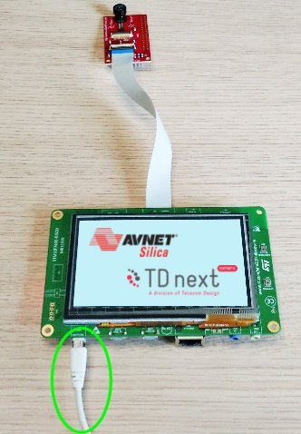

4. The demo will automatically start

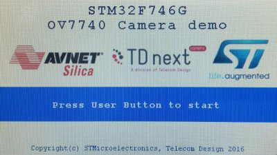

4. Press the **User Button** to see the streaming video from the camera

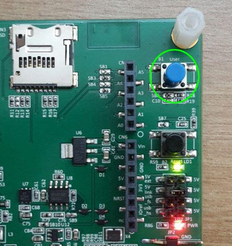

5. The display is touch screen and by touching it in different ways you can interact with the demo

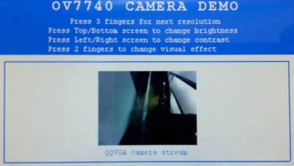

- Press the screen with three fingers to change resolution.
- Press the screen with two fingers to change the effect.
- Press the screen with one finger on the right or left of the screen to raise/decrease the brightness.
- Press the screen with one finger on the top or bottom of the screen to raise/decrease the contrast.

Update the Demo
---------------

If the board is not programmed with the demo firmware you can upload it by yourself.

1. Download accepting the agreement of the **stsw-link009 USB driver** from the `ST website <http://www.st.com/content/st_com/en/products/embedded-software/development-tool-software/stsw-link009.html>`_

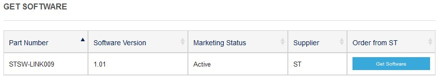

.. note::

  In order to get the software it is necessary to have an account on my.st.com website. You can create it `here <http://www.st.com/content/st_com/en/user-registration.html?referrer=https://my.st.com/content/my_st_com/en/products/embedded-software/development-tool-software/stsw-link009.license%3d1473754475284.html>`_
  
2. Extract and install the driver launching **dpinst_amd64.exe** if you have Windows 64-bit or **dpinst_x86.exe** if your Windows is 32-bit. If you don't know it just go in **Control Panel -> System** to check the version or if you have Windows 10 go to **Settings -> System -> About**.

3. During the installation accept all the persmission requests.

4. Download accepting the agreement of the **stsw-link004 STM32 ST-LINK utility** from the `ST website <http://www.st.com/content/st_com/en/products/embedded-software/development-tool-software/stsw-link004.html>`_

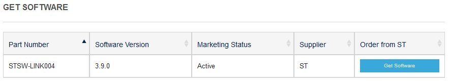

5. Extract and launch the installer. During the installation accept all the permission requests.

Now your Windows is configurated to upload the firmware of the **STM32F746G-DISCO** board

1. Download the `firmware Demo <>`_

2. Plug in the **USB Mini** cable from the PC to the **CN14** connector of the board

3. If all is ok the board will be mounted as a mass storage

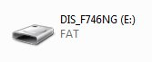

4. Launch the **STM32 ST-LINK Utility**, you can find it going to **Windows menu start->All Programs->stmicroelectronics**

5. Click on the **connect to the target icon** on the toolbar

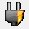

6. Once it is connected click on the **program verify** icon on the toolbar

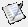

7. From the window click on the **Browse** button and find the **STM32746G_DISCOVERY.bin** file.

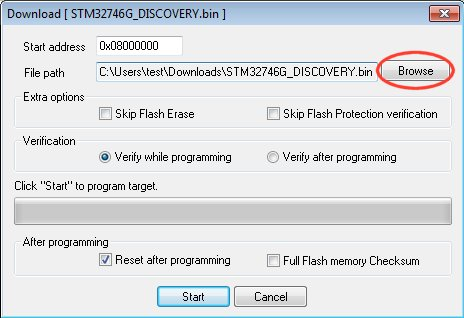

8. Check that the options are right

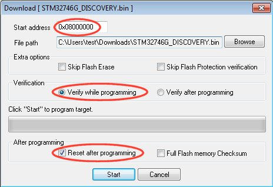

9. Click on the **Start** button to upload the firmware in the board

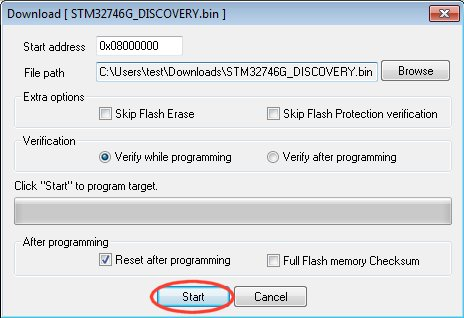

10. After the programming the demo will start automatically

